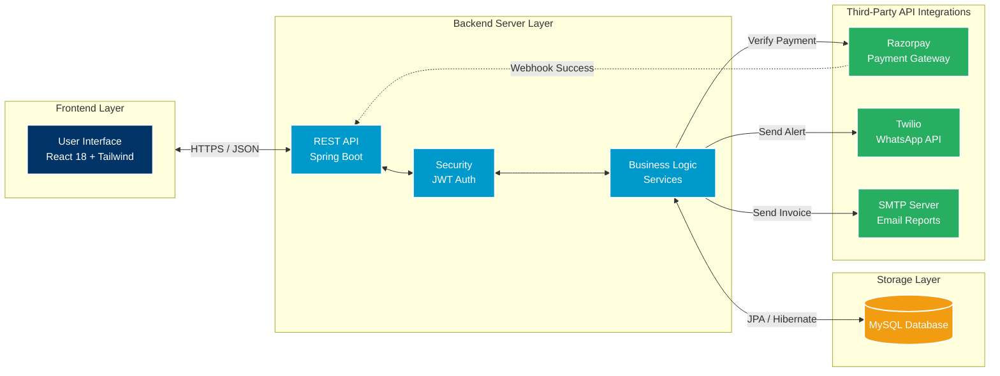
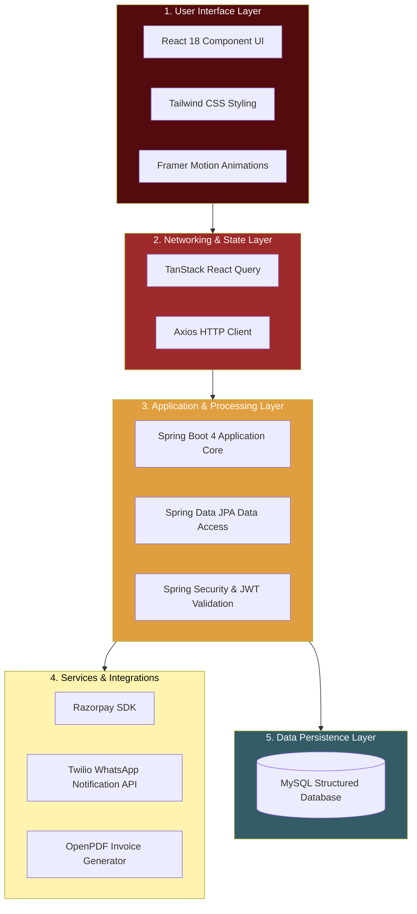
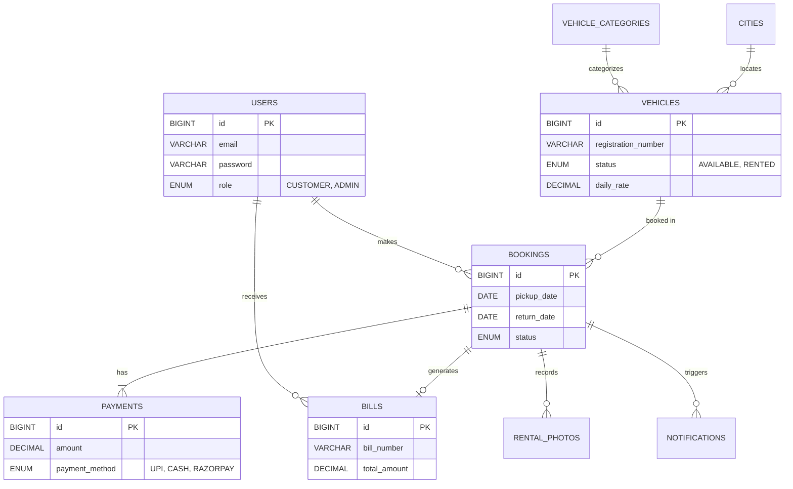
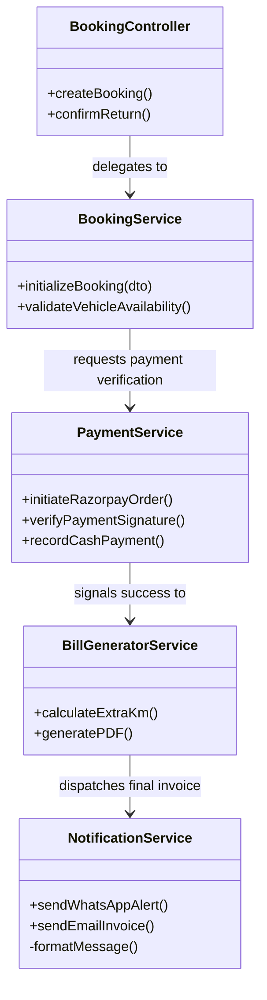

# Car Rental System Presentation Diagrams

*You can copy and paste the code blocks below into [Mermaid Live Editor](https://mermaid.live/) to generate high-quality images (PNG/SVG) that you can insert directly into your PowerPoint slides.*

---

### 1. Overall System Architecture Diagram
This diagram shows the complete high-level data flow, from the React Frontend to the Spring Boot backend, and out to external services like Razorpay and Twilio.

---

### 2. Technology Stack Overview (Layered View)
This represents the different technology stacks separated by logical layers, similar to the multi-level graphics in your reference image.

---

### 3. Entity-Relationship (ER) Diagram
This represents the structure of your MySQL database based on the `database-schema.sql` file.

---

### 4. Class / Service Architecture Diagram
This illustrates the interaction between the core Spring Boot backend services.

